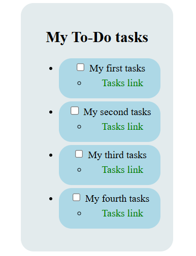

# ☕ Design a Cafe Menu

This project is part of the **Responsive Web Design Certification** from [freeCodeCamp](https://www.freecodecamp.org/).

It focuses on building a structured and visually appealing to-do list using semantic HTML and CSS styling.

---

## 🔗 Live Preview

👉 **View the project here:**  
https://smithsteven22.github.io/responsive-web-design-projects/build-a-stylised-todolist/

---

## 📌 Project Objectives

- Practice semantic HTML structure
- Apply CSS styling and layout techniques
- Understand typography and spacing
- Build a clean static webpage

---

## 🛠️ Technologies Used

- HTML5
- CSS3

---

## 📷 Preview

  

